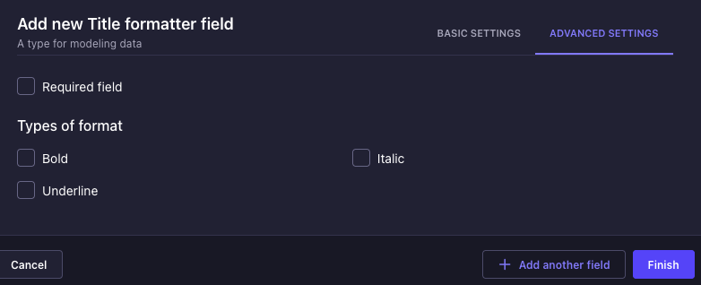
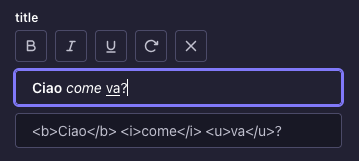

# Strapi plugin title formatter

This plugin is a simple text editor that allows you to format your text with **bold**, *italic*, and __underline__ styles. It also provides a preview of the formatted text in both HTML and Markdown formats.

The project is forked from [@SKLINET/strapi-plugin-bold-title-editor](https://github.com/SKLINET/strapi-plugin-bold-title-editor)

## ✨ Features
* **Different output options:** choose between HTML and Markdown.
* **Actions:**
  * accentuate certain parts (bold, italic, underline)
  * preview code output
  * clear text format

## ⏳ Installation

```sh
# Using NPM
npm install @davideddr/strapi-plugin-title-formatter
```

Then, you'll need to build your admin panel:

```sh
# Using Yarn
yarn build

# Or using NPM
npm run build
```

## ⚙️ Configuration
In the field settings, you can choose which type of formatting to enable.



## 🎉 Usage



### HTML
#### React/Next.js

```tsx
<h1 dangerouslySetInnerHTML={{ __html: title }} />
<h3><a href="#" dangerouslySetInnerHTML={{ __html: title }} /></h3>
```

#### Vue
```html
<h1 v-html="title" />
<h3><a href="#" v-html="title" /></h3>
```

### Markdown
#### React

```tsx
import ReactMarkdown from 'react-markdown'

<ReactMarkdown children={title} />
```
